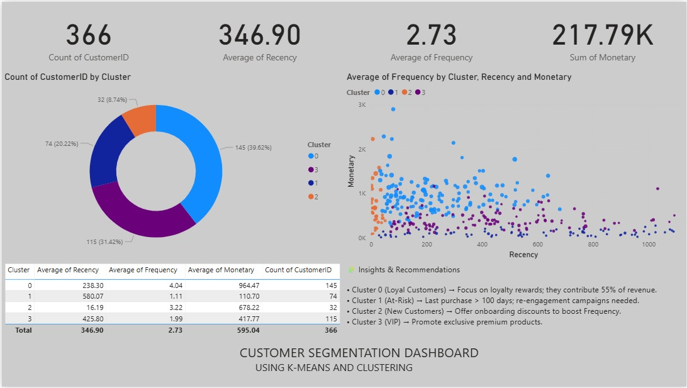

# 🧠 Customer Segmentation Dashboard using RFM & K-Means Clustering

This project performs **Customer Segmentation** using **RFM (Recency, Frequency, Monetary) Analysis** and **K-Means Clustering** to understand customer behavior and target marketing efforts more effectively.  
It also includes an interactive **Power BI Dashboard** for visualizing the customer segments and generating actionable insights.

---

## 🚀 Project Overview

Businesses often need to understand which customers are loyal, which are at risk, and which are new or high-value clients.  
This project uses **RFM metrics** to classify customers and **K-Means Clustering** to automatically group them into meaningful segments.

### 🧩 Segmentation Logic
- **Recency (R):** Days since last purchase  
- **Frequency (F):** Number of transactions  
- **Monetary (M):** Total amount spent  

After performing clustering, customers are divided into these key segments:

| Cluster | Description | Action |
|----------|--------------|--------|
| 🟦 **Cluster 0** | Loyal Customers | Focus on rewards and personalized offers |
| 🟪 **Cluster 1** | At-Risk Customers | Reactivate through re-engagement campaigns |
| 🟧 **Cluster 2** | New Customers | Encourage repeat purchases with discounts |
| 🟨 **Cluster 3** | VIP Customers | Offer premium experiences and exclusive access |

---

## 📁 Repository Structure

| File | Description |
|------|--------------|
| `Customer_Transactions_RFM_Analysis.csv` | Raw transactional dataset used for RFM computation |
| `RFM_Analysis.jpeg` | Power BI dashboard image visualizing segmentation |
| `Customer_Segmentation.ipynb` | Google Colab notebook containing all Python code for analysis and clustering |

---

## 📸 Dashboard Preview

---

## 📊 Key Insights

- **Total Customers:** 366  
- **Average Recency:** 346.9 days  
- **Average Frequency:** 2.73  
- **Total Monetary Value:** 217.79K  
- **Cluster 0 (Loyal Customers)** → contribute ~55% of total revenue  
- **Cluster 1 (At-Risk)** → require re-engagement marketing  
- **Cluster 2 (New Customers)** → represent potential future loyalists  
- **Cluster 3 (VIP)** → respond well to exclusive premium offers  

---

## 🧰 Tools & Technologies Used

- **Python (Google Colab)** – Data cleaning, RFM computation, clustering  
  - Libraries: `pandas`, `numpy`, `matplotlib`, `seaborn`, `scikit-learn`
- **Power BI** – Dashboard design and visualization  
- **GitHub** – Version control and project sharing  

---

## 🧠 Business Impact

This project helps marketing and sales teams:

- 🏆 Identify **loyal and high-value customers** for rewards and retention programs  
- ⚠️ Detect **at-risk customers** to prevent churn and re-engage them with targeted offers  
- 🌱 Focus on **new and growing customer groups** to nurture long-term relationships  
- 🎯 Develop **data-driven marketing campaigns** with higher ROI and personalized strategies  

---

## 📬 Contact

Created by **HIMANSHU YADAV**  
📧 Himanshu; himanshuyadavhimann@gmail.com  
🔗https://www.linkedin.com/in/himanshu-yadav-971226232/
